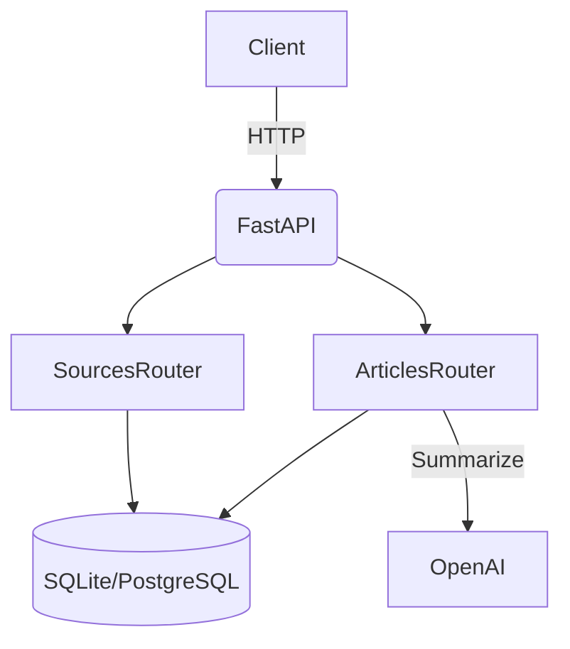

# RSS-GPT: Remediation & Modernization Plan

## Summary

This plan addresses all identified issues and inconsistencies in the project, aligning code and documentation with best practices and your preferences:

- **Pydantic v2** upgrade (with `model_config = {"from_attributes": True}`)
- **Remove all config.ini references** from docs and structure
- **Default summary language:** "fr"
- **Default OpenAI model:** "gpt-4.1-mini"
- **requirements.txt** creation
- **Robust LLM output parsing**
- **Database index for Article.url**
- **Consistent enum usage in schemas**
- **No use of internal feedparser APIs**

---

## 1. requirements.txt

Create a `requirements.txt` with:
```
fastapi
uvicorn
sqlalchemy
feedparser
openai
psycopg2-binary
pydantic>=2.0
python-dotenv
```

---

## 2. Remove config.ini

- Delete all references to `config.ini` and `config.ini.example` from:
  - README.md (project structure, configuration, tips)
  - Any other documentation or comments

---

## 3. Consistent LLM Parameters

- Set these defaults in both code and README:
  - `OPENAI_MODEL`: `"gpt-4.1-mini"`
  - `SUMMARY_LENGTH`: `250`
  - `KEYWORD_COUNT`: `6`
  - `SUMMARY_LANGUAGE`: `"fr"`

---

## 4. Robust LLM Output Parsing

- Use OpenAI's JSON mode if available for the model.
- If not, implement regex-based parsing that tolerates whitespace, capitalization, and extra text.

---

## 5. Error Handling in fetch_articles.py

- Already logs feedparser and summarization errors.
- Optionally, add retry logic for transient errors.

---

## 6. No Internal feedparser APIs

- Replace `feedparser._parse_date` with a public alternative:
  - Prefer `entry.published_parsed` or use `dateutil.parser.parse`.

---

## 7. Database Index for Article URLs

- In `models.py`, change:
  ```python
  url = Column(String, nullable=False)
  ```
  to
  ```python
  url = Column(String, nullable=False, index=True)
  ```

---

## 8. Pydantic v2 Model Config

- For all Pydantic models (e.g., `ArticleOut`, `SourceBase`), replace:
  ```python
  class Config:
      orm_mode = True
  ```
  with
  ```python
  model_config = {"from_attributes": True}
  ```

---

## 9. Enum Usage in Schemas

- In `schemas.py`, use:
  ```python
  from models import SourceStatusEnum
  status: SourceStatusEnum = SourceStatusEnum.ACTIVE
  ```
  instead of `status: str = "active"`

---

## 10. Single Source of DEFAULT_LANGUAGE

- Define `DEFAULT_LANGUAGE = os.environ.get("SUMMARY_LANGUAGE", "fr")` in a config module or at the top of the main script, and import it where needed.

---

## 11. README.md Updates

- Remove all config.ini references.
- Update all LLM parameter defaults to match code.
- Update project structure to remove config.ini.
- Specify Pydantic v2 in requirements and usage.

---

## 12. System Diagram



---

## Next Steps

- Review this plan and confirm if it matches your expectations.
- Once approved, I will switch to code mode for implementation.